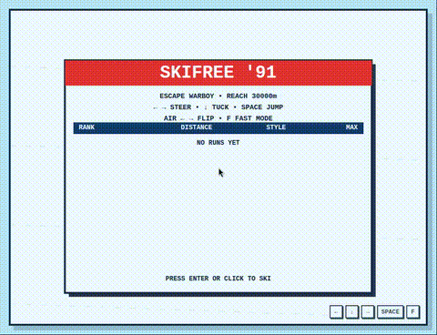

# SkiFree '91 — Canvas Remake ☣️

A single-file HTML5 canvas remake of the 1991 Windows classic **SkiFree** — reforged for the machine cult. Bomb down an endless, procedurally-scrolling slope, thread the trees and slalom gates, stack style points off jumps… and outrun **WARBOY**, the relentless machine-spirit that replaces the old Yeti. Reach **30,000 meters** to ski free.

**▶ [Play it in your browser](https://warboy176.github.io/skifree-warboy/)** — no install, no dependencies, one file.



## Controls

| Action | Keys |
|---|---|
| Start | **Enter** / click / tap |
| Steer | **← →** (arrow keys or pointer) |
| Tuck (speed up) | **↓** |
| Jump | **Space** |
| Flip / spin (mid-air) | **← →** while airborne |
| Fast mode | **F** |
| Restart | **R** |

## The run

- Endless downhill — the further you go, the faster and gnarlier it gets.
- **Escape Warboy** to bank **+500** and keep skiing; get caught and it's *"CAUGHT BY WARBOY!"*
- Land flips for **style**; wiping out on trees and rocks bleeds your speed.
- A local high-score board (distance / style / top speed) persists in your browser.
- Survive to the **FINAL ZONE: MINI WARBOYS** and hit **30,000 m** to ski free.

## Run it locally

It's one file. Open `index.html` in any modern browser, or serve the folder:

```bash
python3 -m http.server 8000    # then open http://localhost:8000
```

## Tech

Pure vanilla JavaScript + Canvas 2D — no frameworks, no build step, no dependencies. Frame-based sprite animation, an endless scrolling world, lightweight collision, and a `localStorage` leaderboard, all in a single ~42 KB `index.html`.

## License

MIT — see [LICENSE](LICENSE).

---

*A Warboy build. ☣️ WITNESS ME.*
